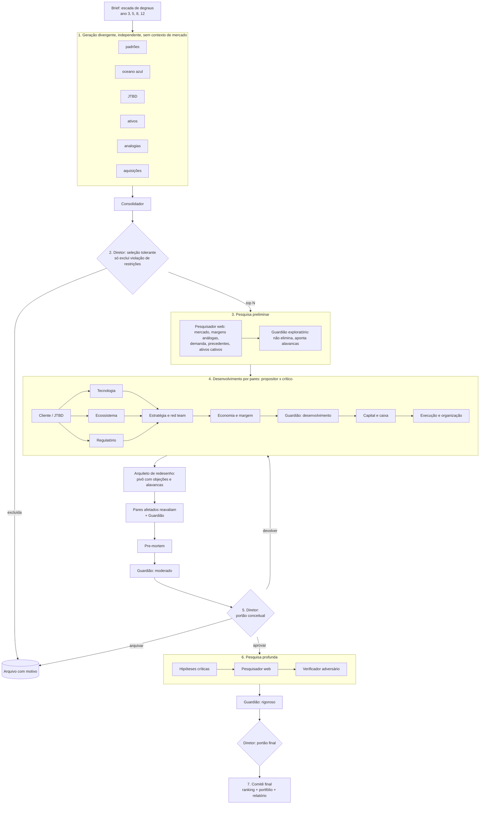

# Laboratório de Modelos de Negócio

Sistema de agentes que gera ideias, pesquisa, critica de forma adversária, avalia escala e margem com rigor crescente e ranqueia novos modelos de negócio para uma torreira global. O objetivo é encontrar o que pode se tornar, em degraus, o motor de crescimento e depois o principal negócio da empresa (meta no brief, seção 2).

## 1. Princípios de projeto

Cada princípio vem de um estudo da etapa de pesquisa e é aplicado num mecanismo concreto do sistema:

| Princípio | Base | Como o sistema aplica |
|---|---|---|
| Separar quem gera de quem avalia | Schweiger et al. (1986); Eisenhardt (1997) | Pares propositor x crítico; Guardião e Diretor não propõem |
| Diversidade de lentes | Hong e Page (2004) | 5 geradores com lentes diferentes; 8 especialidades |
| Julgamento independente antes do debate | Kahneman, Lovallo e Sibony (2011) | Geradores não veem uns aos outros; o crítico não vê a confiança do propositor |
| Dissenso estruturado em vez de consenso | Schweiger et al. (1986): investigação dialética e advogado do diabo superam o consenso | Toda objeção fatal ou alta exige contra-proposta e a evidência que resolveria |
| Processo pesa mais que análise | Lovallo e Sibony (2010): fator de 6 | Portões com regras fixas; objeções abertas e incertezas explícitas |
| Visão externa | Kahneman e Lovallo (1993); Flyvbjerg | Taxas base no brief; o Guardião e os críticos comparam com casos reais |
| Pre-mortem | Mitchell et al. (1989); Klein (2007) | Agente dedicado antes do portão conceitual |
| Teoria com hipóteses testáveis | Camuffo et al. (2020); Felin e Zenger (2017) | Toda afirmação vira hipótese com probabilidade e critério de abandono |
| Evidência real decide | Koning et al. (2022) | Pesquisa na web e verificação adversária antes da recomendação |
| Escala relativa e margem | Christensen; McKinsey; Zook | Guardião de Escala e Margem permanente, com memória entre rodadas e rigor crescente |
| Ideias evoluem com a pesquisa | Felin et al. (2020); Christensen (mercados disruptivos começam pequenos) | Pesquisa preliminar antes de qualquer avaliação; o Guardião não elimina nada no início e aponta alavancas de melhoria |
| Integrador com poder de decidir | O'Reilly e Tushman (2004); Eisenhardt (1989) | O Diretor decide por consenso qualificado; limiares impostos em código |

## 2. Arquitetura



### 2.1 Papéis

| Papel | Quantidade | Arquivo |
|---|---|---|
| Geradores divergentes | 6 lentes (inclui aquisições) | `agents/geradores.md` |
| Consolidador | 1 | (no workflow) |
| Pares propositor x crítico | 8 especialidades | `agents/pares/*.md` + protocolos |
| Guardião de Escala e Margem | Permanente, com memória e 4 modos de rigor | `agents/guardiao.md` |
| Arquiteto de redesenho | 1 por pacote, depois dos pares | `agents/arquiteto.md` |
| Pre-mortem | 1 por pacote | `agents/premortem.md` |
| Diretor (integrador) | Portão conceitual, portão final e comitê | `agents/diretor.md` |
| Pesquisador (preliminar) | 1 por ideia selecionada | `agents/pesquisador.md` |
| Pesquisador e verificador (profundo) | 1 dupla por hipótese crítica | `agents/pesquisador.md`, `agents/verificador.md` |

### 2.2 Os 8 pares de especialidade

| # | Especialidade | Propositor entrega | Crítico ataca como |
|---|---|---|---|
| 1 | Cliente e JTBD | Pagador, dor, orçamento, ciclo de compra, teste de compartilhamento | Cético da demanda |
| 2 | Tecnologia e rede | Arquitetura no site, maturidade, custo de adaptação, obsolescência | Realista técnico |
| 3 | Ecossistema e parcerias | Mapa de valor, coinovação, cadeia de adoção (Adner) | Caçador de dependências |
| 4 | Regulação e jurídico | Licenças, energia, REIT, zoneamento, soberania de dados | Regulador adversário |
| 5 | Estratégia e disrupção | Padrões combinados, vantagem própria, distância do core | Red team de concorrentes |
| 6 | Economia e margem | Economia unitária, teto estrutural, margem incremental, trajetória de 5 anos | Auditor financeiro |
| 7 | Capital e caixa | Investimento, ROIC, conversão de caixa, financiamento, aquisições | Analista de crédito |
| 8 | Execução e organização | Desenho ambidestro, talentos, repetibilidade, marcos | COO cético |

**Ordem de complementação:** cliente primeiro. Depois tecnologia, ecossistema e regulatório, em paralelo. Depois estratégia, economia, capital e execução, nessa ordem. Cada par lê os módulos anteriores e constrói sobre eles.

### 2.3 Ciclo de cada par

1. O propositor escreve o módulo, com hipóteses explícitas (id, tipo, probabilidade, criticidade, critério de abandono).
2. O crítico recebe o módulo **sem** a confiança declarada, reconstrói a versão mais forte e ataca premissas (no máximo 7 objeções, com severidade).
3. Se houver objeção fatal ou alta, o propositor responde a cada uma (aceita, ajustada ou rebatida) e revisa.
4. O crítico confere se a revisão resolveu de fato (rodada 2). O que sobra vai para o **registro de objeções abertas**, que acompanha o pacote até o Diretor.

## 3. O pacote de análise (contrato de dados)

Cada ideia vira um pacote que cresce ao longo do fluxo:

- `ideia`: tese, pagador, ativos alavancados, mecanismos de receita e margem.
- `modulos.<par>`: resumo, análise, contribuição para a meta dupla, hipóteses, números-chave (fato ou estimativa), respostas às objeções.
- `objecoes_abertas`: objeções não resolvidas, com severidade, par e evidência que resolveria.
- `paineis`: histórico do Guardião (receita e margem em P10/P50/P90, teto estrutural, margem incremental, conversão de caixa, probabilidade, desvio de otimismo, parecer).
- `premortem`: causas de fracasso, sinais antecipados e mitigação.
- `decisoes`: notas, nota ponderada, probabilidade e decisão do Diretor.
- `evidencias`: achados com URL, veredito do pesquisador e do verificador.
- `final`: tese final, riscos, condições, experimentos e critérios de abandono.

Os schemas exatos estão no topo de `workflow/laboratorio.workflow.js`.

## 4. Rigor crescente e portões

O rigor aumenta conforme as evidências aparecem. A rubrica completa está em `config/rubrica.md`.

| Momento | Quem avalia | O que pode eliminar uma ideia |
|---|---|---|
| Seleção | Diretor | Só a violação das restrições do brief |
| Depois da pesquisa preliminar | Guardião, modo exploratório | Nada: o Guardião aponta alavancas de escala e margem |
| Checkpoint depois da economia | Guardião, modo desenvolvimento | Nada: registra as alavancas incorporadas |
| Portão conceitual | Guardião (moderado) e Diretor | Nota abaixo de 3,3, probabilidade abaixo de 0,30, objeção fatal aberta ou parecer "complementar" |
| Portão final | Guardião (rigoroso) e Diretor | Nota abaixo de 3,7, probabilidade abaixo de 0,40, hipótese crítica refutada ou parecer diferente de "avança" |

A probabilidade se refere ao **degrau do ano 5** (receita de 18 ou mais e margem de 45% ou mais), com caminho crível para os degraus seguintes.

**Os limiares são impostos em código:** se o Diretor aprovar um pacote que não cumpre algum deles, a aprovação é convertida em devolução para os pares com objeções graves, ou em reprovação no portão final.

## 5. Como executar

O workflow foi feito para a ferramenta Workflow do Claude Code:

```
Workflow({ scriptPath: "business-model-lab/workflow/laboratorio.workflow.js",
           args: { max_finalistas: 4, foco: "opcional: por exemplo, priorizar Europa" } })
```

**Argumentos (todos opcionais):**

| Argumento | Padrão | O que controla |
|---|---|---|
| `ideias_por_gerador` | 4 | Quantas ideias cada uma das 6 lentes gera |
| `max_finalistas` | 4 | Quantas ideias o Diretor seleciona para pesquisa preliminar e desenvolvimento |
| `rodadas_por_par` | 2 | Rodadas de crítica em cada par |
| `max_retornos` | 1 | Quantas vezes o Diretor pode devolver um pacote |
| `max_hipoteses_pesquisa` | 5 | Hipóteses críticas pesquisadas por pacote |
| `limiar_conceitual` | `{nota: 3.3, prob: 0.30}` | Limiares do portão conceitual |
| `limiar_final` | `{nota: 3.7, prob: 0.40}` | Limiares do portão final |
| `foco` | (vazio) | Direcionamento adicional do usuário |
| `redesenho` | `true` | Liga o passo de pivô depois dos pares |
| `candidatas` | (vazio) | Lista de ideias (texto ou objetos) para avaliar sem passar pela geração |
| `base` | caminho absoluto desta pasta | Onde os agentes encontram o brief e os papéis |

**Custo aproximado com os padrões:** de 240 a 320 chamadas de agente. Num teste com 2 finalistas e 1 rodada por par, o sistema usou 53 agentes, cerca de 7,5 milhões de tokens e cerca de 65 minutos, porque os pares fazem pesquisa própria. Use pelo menos 2 rodadas por par: com 1 rodada o propositor nunca responde às objeções. Os principais fatores são o número de finalistas e as devoluções. Com `max_finalistas: 2` e `rodadas_por_par: 1`, cai para cerca de 70 a 90.

**Saída:** ranking, visão de portfólio, relatório em Markdown, ideias arquivadas com o motivo e os pacotes completos. Salve o relatório em `saidas/`.

## 6. Como evoluir o sistema

- **Mudar a meta ou a empresa:** edite `config/brief.md`. É a única fonte de verdade.
- **Atualizar o contexto de mercado:** edite `config/contexto-mercado.md`. Os geradores não leem este arquivo, para não se ancorarem nos mesmos temas.
- **Mudar critérios ou pesos:** edite `config/rubrica.md` e o objeto `PESOS` no workflow.
- **Adicionar uma especialidade:** crie `agents/pares/<chave>.md` com as seções Propositor e Crítico, e inclua a chave em `PARES` e `ETAPAS`.
- **Calibração:** depois de algumas execuções, compare as probabilidades do Diretor com o que se confirmar nos experimentos reais e ajuste os limiares.

## 7. Limitações conhecidas

- **Agentes de linguagem tendem a convergir e concordar** (Du et al., 2023; Liang et al., 2023). O sistema reduz esse risco com papéis distintos, críticos que não veem a confiança do propositor, um Guardião independente e limiares em código, mas não o elimina.
- **A qualidade da pesquisa depende das fontes públicas disponíveis.** Dados de preço e contratos de operadoras raramente são públicos. O sistema marca essas hipóteses como inconclusivas, e elas viram experimentos reais.
- **As probabilidades são julgamentos calibrados por taxas base, não frequências medidas.** Use o ranking para priorizar a validação no mundo real, não como garantia.
